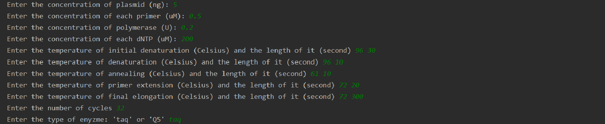
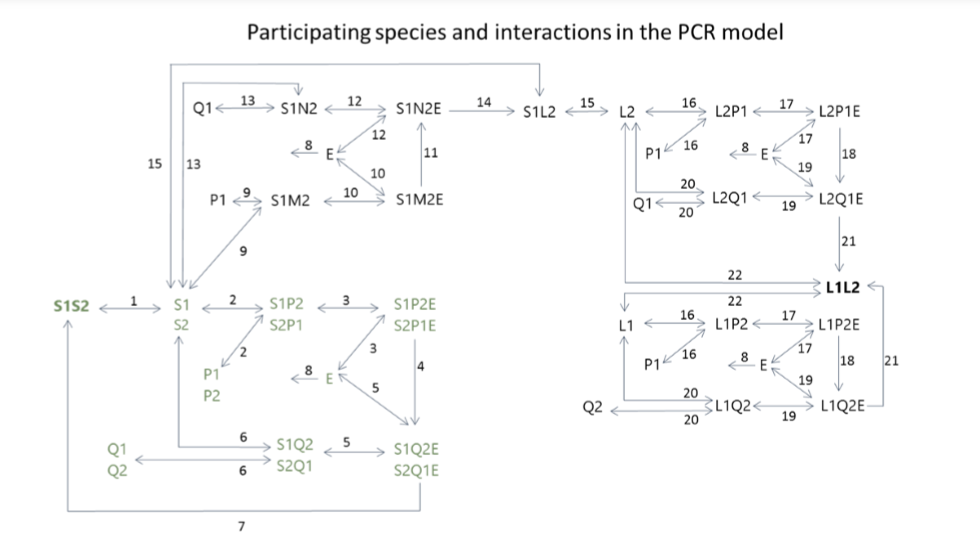

## Background

This repository contains the improving versions of my master's project for MSc Bioinformatics at Newcastle University from where I graduated in 2019.

The aim of this dissertation was to develop a computational model of polymerase chain reaction (PCR) including the possibility of primer misbinding, providing a more sensitive PCR model to support the teaching process of complex experimental design.

The created model is based on a dynamical system, displaying 33 species and 22 interactions between them. Primer misbinding can only occur on one of the DNA strands in order to keep the number of participating species relatively low. For the same reason only one extended primer stage was distinguished. The model includes certain thermodynamic parameters such as change of entropy, enthalpy and Gibbs free energy. The dNTP incorporation rate of the enzyme is set to be temperature-dependent, and the enzyme denatures at high temperatures. The set value of entropy difference, rate of enzyme denaturation and the effective length of primer mismatch was estimated after assessing different values’ impact on the behaviour of the model.

In order to run the PCR model, the user provides 16 experimental factors: the concentrations of the dsDNA, primers, enzyme and dNTP, the temperature and length of initial denaturation, denaturation, annealing, extension and final extension. Furthermore, the number of cycles and the type of enzyme is also chosen by the user. The enzyme type can be either Taq or Q5, which show different enzyme activity at different temperatures. The outcome is five plots displaying the concentration change over time of all the participant species and the purity level of the dsDNA. 

## Running the model

In order to use the program, download the Master-Project and run the "master_PCR_complete.py" file.

An example input for the species' contentration and temperature setting in the polymerase chain reaction model is shown below:

 

 

## Explanation of the output

This figure below shows all the participant species of the PCR model and the interactions between them. The species with only accurate primer binding sites are shown in green, while the added species with primer misbinding are shown in black. 

 

 

Presuming accurate primer binding sites, the components of the dynamical system are the following: 

-	double- stranded DNA (S1S2) 
- single -stranded DNA (S1, S2) 
- complementary primer to S1 (P2) 
-	complementary primer to S2 (P1)
-	DNA polymerase (E) 
-	binary complex of single- stranded DNA and complementary primer (S1P2, S2P1) 
-	ternary complex of single- stranded DNA, complementary primer and DNA polymerase (S1P2E, S2P1E) 
-	nucleotides (dNTP)
-	ternary complex of single- stranded DNA, complementary extended primer and DNA polymerase (S1Q2E, S2Q1E)
-	binary complex of single- stranded DNA and complementary extended primer (S1Q2, S2Q1) 
-	extended primer (Q1, Q2) 

The following interactions are modelled between the components above:

-	hybridisation – dehybridisation (1)
-	primer binding – unbinding (2, 6) 
-	polymerase binding – unbinding (3, 5)
-	primer extension (4, 7) 
-	enzyme denaturation (8) 

 

The previously declared components were extended to accommodate the primer misbinding option in the system with the following species:

-	complementary misbinding primer to S1 (M2)
-	binary complex of single- stranded DNA and complementary misbinding primer (S1M2)
-	ternary complex of single- stranded DNA, complementary misbinding primer and DNA polymerase (S1M2E)
-	ternary complex of single- stranded DNA, complementary misbinding extended primer and DNA polymerase (S1N2E)
-	binary complex of single- stranded DNA and complementary misbinding extended primer (S1N2)
-	double-stranded product of single-stranded target DNA and single-stranded misbinding product (S1L2)
-	single-stranded misbinding product (L1, L2)
-	binary complex of single- stranded misbinding product and complementary primer (L1P2, L2P1)
-	ternary complex of single- stranded misbinding product, complementary primer and DNA polymerase (L1P2E, L2P1E)
-	ternary complex of single- stranded misbinding product, complementary extended primer and DNA polymerase (L1Q2E, L2Q1E) 
-	binary complex of single- stranded misbinding product and complementary extended primer (L1Q2, L2Q1) 

The type of interactions between these components remained the same as described in the first part:

-	hybridisation - dehybridisation (15, 22)
-	primer binding - unbinding (9, 13, 16, 20)
-	polymerase binding- unbinding (10, 12, 17, 19)
-	primer extension (11, 14, 18, 21)

After running the program, the predicted concentration of the participating species is shown in the following order:

species = ["S1S2", "S1", "S2", "P1", "P2", "S1P2", "S2P1", "E", "S1P2E", "S2P1E", "dNTP", "Q1", "Q2", "S1Q2E", "S2Q1E", "S1Q2", "S2Q1", "S1M2", "S1M2E", "S1N2E", "S1L2", "L2", "S1N2", "L2P1", "L2P1E", "L2Q1E", "L1L2", "L2Q1", "L1", "L1P2", "L1P2E", "L1Q2E", "L1Q2"] 
